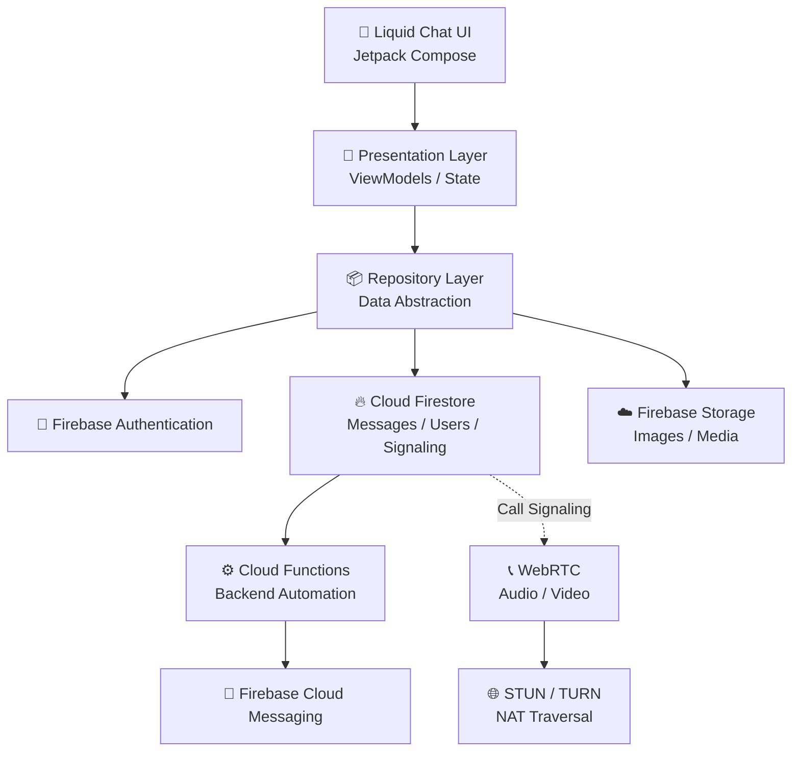

# 💬 Liquid Chat 2.5.0

<p align="center">
  
</p>

<h3 align="center">
  A modern Android messaging experience built with Kotlin, Jetpack Compose & Firebase.
</h3>

<p align="center">
  <a href="https://github.com/officialpritam007/pro777/releases/latest">
    
  </a>
  <a href="https://github.com/officialpritam007/pro777/actions/workflows/build-apk.yml">
    
  </a>
  
  
</p>

<p align="center">
  
  
  
  
  
  
</p>

---

## ✨ Overview

**Liquid Chat** is a modern Android messaging application focused on a clean **Liquid Glass-inspired interface**, real-time communication, Firebase integration, media sharing, notifications, and a scalable architecture.

Version **2.5.0** brings together the core messaging experience, media flows, status infrastructure, notification foundation, biometric support, and call-signaling architecture.

> **Built for Android. Designed around simplicity. Engineered for scale.**

---

## 📱 Screenshots

<p align="center">
  
  
  
</p>

<p align="center">
  
  
  
</p>

### Screenshot files

```text
docs/
└── screenshots/
    ├── home.png
    ├── chat.png
    ├── status.png
    ├── calls.png
    ├── profile.png
    └── settings.png
```

---

## 🚀 Download APK

<p align="center">
  <a href="https://github.com/officialpritam007/pro777/releases/latest">
    
  </a>
</p>

Download the latest available APK from the GitHub Releases page.

### GitHub Actions APK

Successful GitHub Actions builds can publish the debug APK as an artifact.

```text
GitHub
  ↓
Actions
  ↓
Build Android APK
  ↓
Artifacts
  ↓
pro777-debug-apk
```

---

# 🌊 Why Liquid Chat?

Liquid Chat combines familiar messaging functionality with a modern Android-first experience.

### Core Features

* 💬 Real-time messaging
* 👤 User authentication
* 👥 Group conversation foundation
* 📸 Image and media sharing
* 📷 Camera integration
* 🟢 Status system
* 🔔 Push notification infrastructure
* 📞 Voice/video calling UI
* 🔐 Biometric application lock
* ☁️ Firebase-backed architecture
* 🎨 Liquid Glass-inspired UI
* ⚡ Jetpack Compose
* 🧩 Repository-based architecture
* 🤖 GitHub Actions automated builds

---

# 🧩 Feature Matrix

| Feature                 | Status | Technology            |
| ----------------------- | :----: | --------------------- |
| 💬 Real-time Chat       |    ✅   | Cloud Firestore       |
| 👤 Authentication       |    ✅   | Firebase Auth         |
| 👥 Group Chat           |   🟡   | Firestore             |
| 📸 Media Sharing        |   🟡   | Firebase Storage      |
| 📷 Camera Flow          |   🟡   | Android APIs          |
| 🟢 Status System        |   🟡   | Firebase              |
| 🔔 Push Notifications   |   🟡   | FCM                   |
| 🔐 Biometric Lock       |   🟡   | Android Biometric API |
| 📞 Calling UI           |   🟡   | Jetpack Compose       |
| 🎙️ Voice Calling       |   🟡   | WebRTC                |
| 📹 Video Calling        |   🟡   | WebRTC                |
| 🔄 Call Signaling       |   🟡   | Firestore             |
| ☁️ Cloud Backup         |    ⬜   | Planned               |
| 🛡️ Production Security |   🟡   | Firebase Rules        |
| 🤖 CI/CD APK Build      |    ✅   | GitHub Actions        |

**Legend:**
`✅ Implemented` · `🟡 In Progress / Configuration Required` · `⬜ Planned`

---

# 🏗️ Architecture



### Architecture Principles

| Layer          | Responsibility                               |
| -------------- | -------------------------------------------- |
| UI             | Jetpack Compose screens and user interaction |
| Presentation   | ViewModels and reactive state                |
| Repository     | Data abstraction                             |
| Authentication | Firebase user authentication                 |
| Database       | Firestore messaging and signaling            |
| Storage        | Media files                                  |
| Notifications  | Firebase Cloud Messaging                     |
| Backend        | Cloud Functions                              |
| Calling        | WebRTC                                       |
| NAT Traversal  | STUN/TURN                                    |

> Firestore can provide signaling/data exchange, while WebRTC handles actual real-time audio/video media.

---

# 🛠️ Technology Stack

| Category       | Technology               |
| -------------- | ------------------------ |
| Language       | Kotlin                   |
| UI             | Jetpack Compose          |
| Android        | Android SDK / AndroidX   |
| Architecture   | Repository + ViewModel   |
| Authentication | Firebase Authentication  |
| Database       | Cloud Firestore          |
| Storage        | Firebase Storage         |
| Notifications  | Firebase Cloud Messaging |
| Backend        | Firebase Cloud Functions |
| Calling        | WebRTC                   |
| Signaling      | Firestore                |
| NAT Traversal  | STUN / TURN              |
| Build System   | Gradle                   |
| CI/CD          | GitHub Actions           |
| Source Control | GitHub                   |

---

# 🔥 Firebase Setup

Liquid Chat uses Firebase as its primary backend foundation.

| Firebase Service   | Purpose                     | Required |
| ------------------ | --------------------------- | :------: |
| 🔐 Authentication  | User authentication         |     ✅    |
| 💬 Cloud Firestore | Messages, users & signaling |     ✅    |
| ☁️ Storage         | Images and media            |     ✅    |
| 🔔 Cloud Messaging | Push notifications          |     ✅    |
| ⚙️ Cloud Functions | Server-side automation      |    🟡    |
| 🛡️ App Check      | Abuse protection            |    🟡    |
| 📊 Analytics       | Product analytics           |     ⬜    |
| 🐞 Crashlytics     | Crash monitoring            |     ⬜    |

## Firebase Configuration

### 1. Create Firebase Project

Create a project in the Firebase Console.

### 2. Register Android Application

Register the Android application using the package/application ID configured in the project.

### 3. Add `google-services.json`

Place the Firebase configuration file here:

```text
app/google-services.json
```

### 4. Enable Services

Enable:

```text
Authentication
Cloud Firestore
Firebase Storage
Firebase Cloud Messaging
Cloud Functions
```

### 5. Deploy Backend Configuration

Deploy:

```text
Firestore Rules
Firestore Indexes
Storage Rules
Cloud Functions
```

---

# 🔔 Firebase Cloud Messaging

FCM provides the push-notification infrastructure for events such as:

* 💬 New messages
* 📞 Incoming calls
* 👥 Group notifications
* 🟢 Status events
* 🔔 Application notifications

Production notification delivery requires the Firebase project and Android application to be correctly configured.

---

# 📞 Voice & Video Calling

Liquid Chat separates **signaling** from **media transport**.

```text
Caller
   │
   ▼
Firestore Signaling
   │
   ├── SDP Offer
   ├── SDP Answer
   └── ICE Candidates
   │
   ▼
WebRTC
   │
   ├── 🎙️ Audio
   └── 📹 Video
   │
   ▼
STUN / TURN
   │
   ▼
Receiver
```

### Production Calling Requirements

* WebRTC media engine
* STUN server
* TURN server
* Secure signaling
* Call state management
* Runtime permissions
* Incoming-call handling
* Network recovery

> Firestore is used for signaling; it does not replace the WebRTC media transport layer.

---

# 🔐 Security

Liquid Chat is designed around Android platform security and Firebase security rules.

Recommended production architecture:

```text
Firebase Authentication
          ↓
Firestore Security Rules
          ↓
Storage Security Rules
          ↓
Firebase App Check
          ↓
Cloud Functions
          ↓
Server-side Validation
```

### Never commit secrets

Do **not** commit:

```text
service-account.json
private signing keys
release keystores
keystore passwords
GitHub personal access tokens
TURN private credentials
server secrets
```

Use **GitHub Actions Secrets** or secure environment variables for CI/CD credentials.

---

# 🤖 GitHub Actions

<p align="center">
  <a href="https://github.com/officialpritam007/pro777/actions">
    
  </a>
</p>

### Build Pipeline

```text
Git Push
   │
   ▼
GitHub Actions
   │
   ├── Checkout source
   ├── Setup JDK
   ├── Configure environment
   ├── Configure Gradle
   ├── Build Debug APK
   │
   ▼
APK Artifact
```

### Manual Build

```text
GitHub
→ Actions
→ Build Android APK
→ Run workflow
```

---

# 📦 APK Output

After a successful build:

```text
app/
└── build/
    └── outputs/
        └── apk/
            └── debug/
                └── app-debug.apk
```

---

# 💻 Local Development

Clone the repository:

```bash
git clone https://github.com/officialpritam007/pro777.git
cd pro777
```

Build the debug APK:

```bash
gradle assembleDebug
```

APK location:

```text
app/build/outputs/apk/debug/
```

---

# 📁 Project Structure

```text
pro777/
│
├── app/
│   ├── src/
│   │   └── main/
│   │       ├── java/
│   │       ├── res/
│   │       └── AndroidManifest.xml
│   │
│   ├── google-services.json
│   └── build.gradle.kts
│
├── .github/
│   └── workflows/
│       └── build-apk.yml
│
├── docs/
│   ├── assets/
│   │   └── liquid-chat-logo.png
│   │
│   └── screenshots/
│       ├── home.png
│       ├── chat.png
│       ├── status.png
│       ├── calls.png
│       ├── profile.png
│       └── settings.png
│
├── firebase/
│   ├── firestore.rules
│   ├── firestore.indexes.json
│   └── storage.rules
│
├── gradle/
├── build.gradle.kts
├── settings.gradle.kts
└── README.md
```

---

# 🗺️ Roadmap

## Version 2.5.x — Stabilization

* [x] Modern Compose UI
* [x] Core messaging architecture
* [x] Firebase foundation
* [x] GitHub Actions APK build
* [ ] Complete Firebase production deployment
* [ ] Improved error handling
* [ ] Performance optimization
* [ ] Crash monitoring

## Version 2.6.x — Communication

* [ ] Complete FCM delivery flow
* [ ] Incoming-call handling
* [ ] WebRTC voice calling
* [ ] WebRTC video calling
* [ ] STUN/TURN production configuration
* [ ] Call history
* [ ] Call state recovery

## Version 2.7.x — Cloud & Backup

* [ ] Cloud backup
* [ ] Media backup
* [ ] Account restoration
* [ ] Multi-device synchronization
* [ ] Improved status expiry
* [ ] Automated backend cleanup

## Version 3.0 — Production Platform

* [ ] Production release signing
* [ ] Google Play release pipeline
* [ ] Firebase App Check
* [ ] Advanced abuse protection
* [ ] Rate limiting
* [ ] Security hardening
* [ ] Crashlytics
* [ ] Automated release management
* [ ] Comprehensive automated testing

---

# 🧪 Development Status

| Component                |         Status        |
| ------------------------ | :-------------------: |
| 📱 Android Application   | 🟢 Active Development |
| 🎨 UI System             |       🟢 Active       |
| 🔥 Firebase Architecture |       🟢 Active       |
| 💬 Messaging             |       🟢 Active       |
| 🔔 Notifications         |    🟡 Configuration   |
| 📞 Calling               |     🟡 Integration    |
| ☁️ Cloud Backup          |       🟡 Planned      |
| 🛡️ Production Security  |      🟡 Hardening     |
| 🚀 Play Store Release    |       ⬜ Planned       |

> A feature shown in the architecture does not necessarily mean that its complete production backend configuration has already been deployed.

---

# 👨‍💻 Developer

## Pritam Pal

**Creator & Developer — Liquid Chat**

|                 |                                                                 |
| --------------- | --------------------------------------------------------------- |
| 👨‍💻 Developer | **Pritam Pal**                                                  |
| 📧 Email        | **[officialpritam@gmail.com](mailto:officialpritam@gmail.com)** |
| 🐙 GitHub       | **[@officialpritam007](https://github.com/officialpritam007)**  |
| 📦 Repository   | **[Liquid Chat](https://github.com/officialpritam007/pro777)**  |

For development-related questions, bug reports, collaboration, licensing, or project inquiries, please contact the developer.

---

# 📞 Contact

Have a question, found a bug, or want to discuss Liquid Chat?

### Developer

**Pritam Pal**

📧 **[officialpritam@gmail.com](mailto:officialpritam@gmail.com)**

When reporting a technical issue, please include:

* Liquid Chat version
* Android version
* Device model
* Steps to reproduce
* Expected behavior
* Actual behavior
* Error message/log
* Screenshots if applicable

---

# 🤝 Contributing

Contributions, bug reports, feature ideas, and improvements are welcome.

```bash
git checkout -b feature/my-feature
git add .
git commit -m "feat: add my feature"
git push origin feature/my-feature
```

Then open a Pull Request.

---

# 🐛 Bug Reports

Before opening an issue, check whether the problem has already been reported.

When creating an issue, provide enough information to reproduce the problem.

Recommended format:

```text
Device:
Android Version:
Liquid Chat Version:

Problem:
Steps to Reproduce:

Expected:
Actual:

Error / Log:
```

---

# 📄 License

This project is currently under active development.

The applicable license and permissions are defined by the repository's `LICENSE` file.

For licensing or permission inquiries:

📧 **[officialpritam@gmail.com](mailto:officialpritam@gmail.com)**

---

# © Copyright

**© 2026 Pritam Pal. All rights reserved.**

**Liquid Chat**, its original source code, application design, branding, graphics, documentation, and original project assets are protected by applicable copyright laws unless otherwise stated.

No permission is granted to:

* Repackage the application and distribute it as an original work
* Remove or alter copyright notices
* Claim the original project as your own
* Use the Liquid Chat branding without authorization
* Redistribute proprietary project assets without permission

For commercial use, redistribution, licensing, or other permission requests, contact:

**Pritam Pal**
📧 **[officialpritam@gmail.com](mailto:officialpritam@gmail.com)**

> The copyright notice does not replace the repository's actual software license. The `LICENSE` file governs permitted use of the source code.

---

# 🔗 Project Links

| Resource          | Link                                                 |
| ----------------- | ---------------------------------------------------- |
| 📦 Repository     | https://github.com/officialpritam007/pro777          |
| 🚀 Releases       | https://github.com/officialpritam007/pro777/releases |
| ⚙️ GitHub Actions | https://github.com/officialpritam007/pro777/actions  |
| 🐛 Issues         | https://github.com/officialpritam007/pro777/issues   |
| 👨‍💻 Developer   | https://github.com/officialpritam007                 |

---

<p align="center">

## 💬 Liquid Chat 2.5.0

### Modern Messaging • Clean Architecture • Liquid Experience

**Developed with ❤️ by Pritam Pal**

📧 **[officialpritam@gmail.com](mailto:officialpritam@gmail.com)**

© 2026 **Pritam Pal** — All Rights Reserved

<br>

⭐ **Star the repository to follow the project**

</p>
